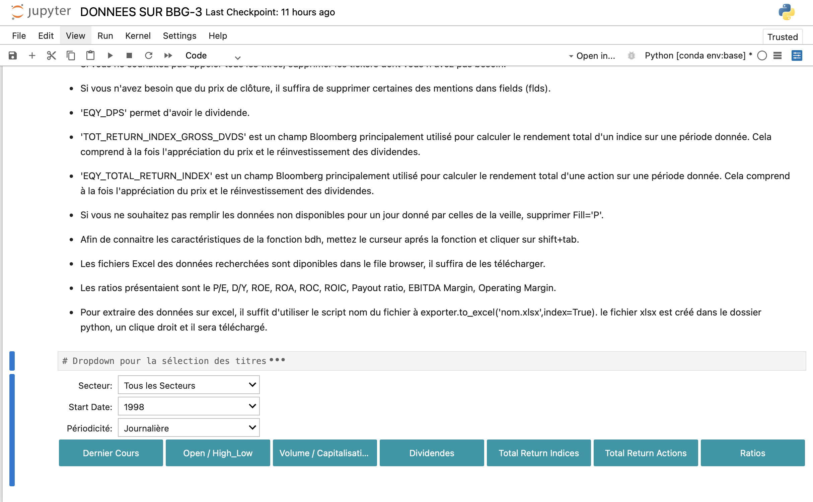

**OVERVIEW**

This repository contains an interactive Jupyter Notebook designed analyze market data from Bloomberg (BBG).             

**DONNEES SUR BBG-3.ipynb**   

*Financial Data Extraction & Preprocessing using Bloomberg API*  

* Loads financial data from Bloomberg.         
* Computes prices, returns, volatilities, and risk-adjusted measures.   
* Exports structured data to Excel.     

**Getting Started**

You will need to install from statsmodels, blpapi and ipywidgets pip using the following command:

* !pip install statsmodels   

* !pip install blpapi         

* !pip install ipywidgets    

## User Interface Preview

Here’s what the platform looks like:

